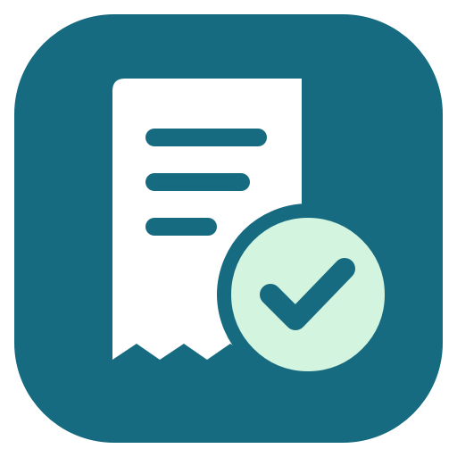
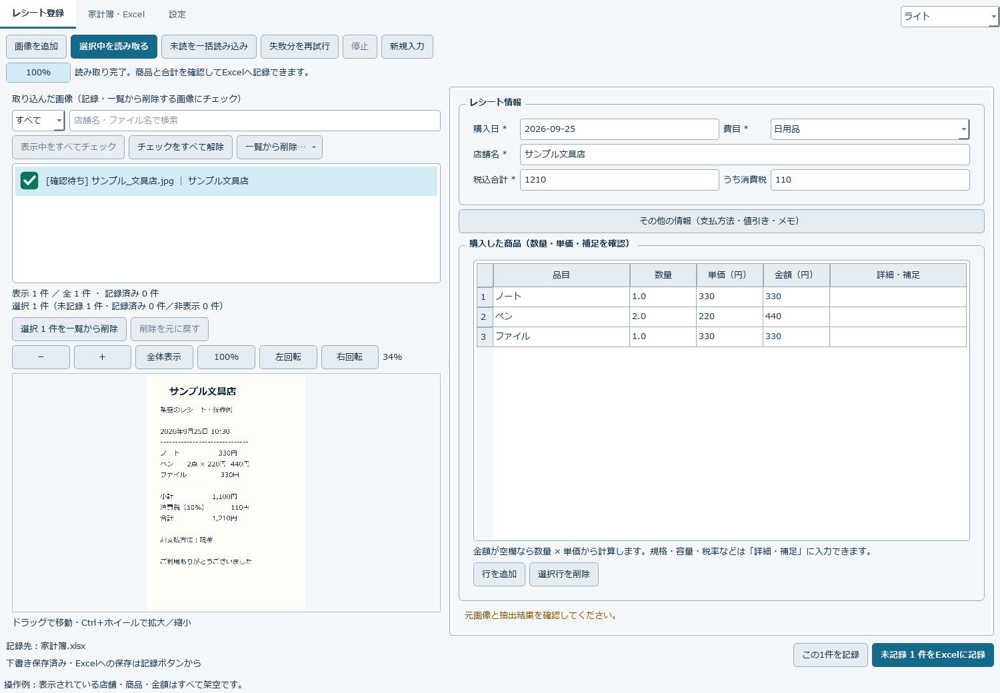

# ReceiptLedger — レシート家計簿

**レシートをLM Studioで読み取り、確認してExcel家計簿へ。**

Windows用のデスクトップアプリです。ローカルPCまたは家庭内LANのLM Studioを利用します。画像と家計簿を自分のPCで管理できます。

## できること

- **JPG / JPEG / PNG / WebP / HEIC / HEIF**をドラッグ＆ドロップで追加。一括読み取りにも対応。
- 読み取り中も、完了したレシートの商品・数量・単価・税込合計・税額を編集。
- 確認したレシートにチェックし、まとめてExcelへ記録。
- レシート別の商品明細、ダッシュボード、月別集計を備えたExcel家計簿。
- 下書きの自動保存、一覧の検索・絞り込み、画像の拡大・回転、削除の取り消し。
- Windows連動のライト／ダーク表示、手動切り替え。
- 画像保存先の変更、データ一式のバックアップ・復元。

## 動作環境

| 項目 | 内容 |
|---|---|
| アプリ | Windows 10 / 11、64ビット（x64）向け。今回の動作検証はWindows 11で実施 |
| 読み取り | LM Studioと画像入力対応のローカルモデル。アプリとは別途導入 |
| 推論用GPU・メモリ | 使用モデルに依存。LM Studioを別PCで動かす場合、アプリ側でモデルを読み込む必要はありません |
| Excel | `.xlsx`への保存にExcelのインストールは不要。開いて閲覧するには対応ソフトを利用 |

LM Studioとモデルは配布ZIPに含みません。読み取り結果はモデルと撮影状態によって変わるため、元画像と確認してから記録してください。

## 使い始める

1. Windows版ZIPを、ドキュメントなど書き込み可能な場所に展開します。[Releases](https://github.com/heavyfox/ReceiptLedger/releases) から取得できます。
2. 展開した `ReceiptLedger` フォルダの `ReceiptLedger.exe` を起動します。`_internal` フォルダも必要です。
3. LM Studioで画像入力対応モデルを読み込み、サーバーを起動します。
4. アプリの **設定** で接続先を指定します。同じPCなら `http://localhost:1234/v1`。別PCならサーバーPCのLANアドレスを指定し、LAN公開・認証を設定します。
5. **接続テスト・モデル取得**で接続を確認し、モデルを選びます。成功時の接続設定と選択モデルは自動保存され、次回起動時に復元します。
6. レシートを追加 → 読み取り → 内容を確認・修正 → チェックした未記録分をExcelへ記録します。

初期保存先は、実行ファイル横の `data/excel` と `data/images`。以前の設定がある場合は引き継ぎます。

- [詳しい使い方・困ったとき](docs/USAGE.md)
- [更新・PC移行](UPDATE.md)
- [開発・ビルド](docs/BUILD.md)
- [公開担当者向け手順](docs/RELEASE.md)

## データと通信

画像は設定したLM Studioサーバーに送信します。クラウドAPIへの自動送信・利用状況の収集は実装していません。LAN内HTTPは暗号化されないため、信頼できるネットワークで使用してください。設定・下書きは `%LOCALAPPDATA%/ReceiptLedger`、認証トークンはWindows資格情報マネージャーへ保存します。トークンはバックアップに含みません。

アプリ更新時は [更新手順](UPDATE.md) に沿って、先にバックアップを作成してください。

## バージョンとライセンス

**1.4.1**。アプリ本体・アイコン・説明書・架空のテスト画像は [MIT](LICENSE)。第三者ライブラリは各ライセンスに従います。[同梱ライブラリと対応ソース](THIRD_PARTY_NOTICES.md) を参照してください。

配布するWindows版と同じReleasesに、対応ソースZIPとSHA-256を掲載する構成です。
